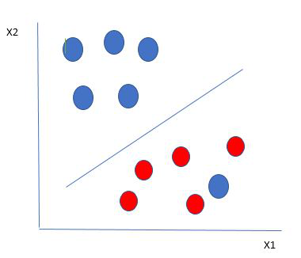
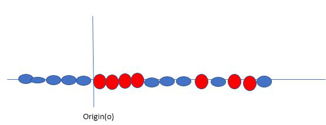
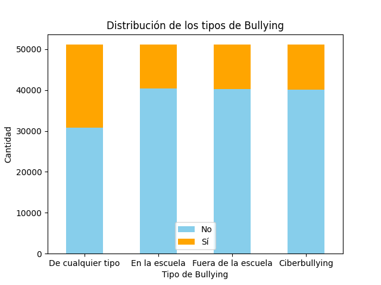
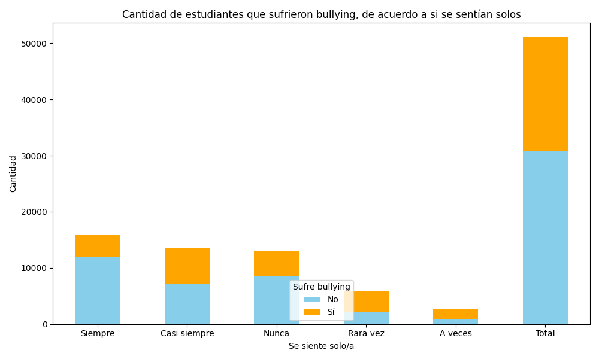

# Detección de casos de bullying

**Código del proyecto: BULL**

**Integrantes: Francisco Devaux (13848) y Bautista Frigolé (13675)**

## Introducción

En el presente informe se aborda un problema de _inteligencia artificial_, específicamente en el campo del aprendizaje automático y ciencia de datos. Nuestro objetivo es probar dos algoritmos (Random Forest y Support Vector Machine) y crear un _modelo de clasificación_, para que dado un dataset, éste sea capaz de identificar situaciones de bullying entre estudiantes, con el fin de prevenir y abordar este grave problema que afecta a los jóvenes.

La elección de estos algoritmos responde a la necesidad de modelar relaciones no lineales, gestionar conjuntos de datos extensos y enfrentar posibles desequilibrios en la distribución de clases. Estos métodos destacan por su capacidad para manejar múltiples características y proporcionar resultados robustos, lo cual es esencial en un entorno tan diverso como el estudiantil.

No obstante, los modelos deben ser cuidadosamente ajustados y evaluados para garantizar resultados precisos y relevantes. Además, la interpretación de los resultados puede requerir consideraciones éticas y contextualización adecuada dada la naturaleza sensible de los datos de salud estudiantil.

A lo largo de este informe iremos explicando un marco teórico de cada uno de los algoritmos mencionados, el experimento práctico con la configuración y los resultados de los modelos. Además, concluiremos realizando una comparación de ambos modelos, teniendo en cuenta sus ventajas y desventajas, analizando cuál es el de uso más conveniente.

## Marco teórico

### Random Forest

**Árboles de decisión**

El algoritmo de Random Forest se compone de la construcción de múltiples arboles de decisión, concepto el cual se explicará brevemente a continuación.
Los árboles de decisión buscan contestar una pregunta de sí o no, como por ejemplo "¿Debería navegar?" A partir de ahí, puede hacer una serie de preguntas para determinar una respuesta, como, "¿Es un oleaje prolongado?" o "¿El viento sopla en alta mar?".
Estas son las preguntas que construirán los nodos de decisión del árbol, cuyas respuestas van a dirigir a una nueva pregunta hasta llegar a un nodo hoja que de una respuesta de sí o no.  
Este árbol de decisiones es un ejemplo de un problema de clasificación, donde las etiquetas de clase son "navegar" y "no navegar".
Si bien los árboles de decisión son algoritmos comunes de aprendizaje supervisado, pueden ser propensos a problemas, como sesgos y sobreajuste. Sin embargo, cuando varios árboles de decisión forman un conjunto en el algoritmo de random forest, predicen resultados más precisos, especialmente cuando los árboles individuales no están correlacionados entre sí.

**Métodos de conjunto**

Otro concepto importante para entender el funcionamiento de Random Forest es el de los métodos de aprendizaje por conjuntos, los cuales se componen de un conjunto de clasificadores, por ejemplo, árboles de decisión, y sus predicciones se agregan para identificar el resultado más popular.
Los métodos de conjunto más conocidos son el ensacado, también conocido como agregación de arranque, y el impulso. En el primer método, se selecciona una muestra aleatoria de datos en un conjunto de entrenamiento con reemplazo, lo que significa que los puntos de datos individuales se pueden elegir más de una vez. Después de generar varias muestras de datos, estos modelos se entrenan de forma independiente y, según el tipo de tarea, es decir, regresión o clasificación, el promedio o la mayoría de esas predicciones arrojan una estimación más precisa. Este enfoque se usa comúnmente para reducir la variación dentro de un conjunto de datos ruidoso.

**Algoritmo de Random Forest**

El algoritmo de Random Forest es una extensión del método de ensacado, ya que utiliza tanto el ensacado como la aleatoriedad de características para crear un bosque no correlacionado de árboles de decisión.

La aleatoriedad de features, también conocida como agrupación de características o "el método del subespacio aleatorio ", genera un subconjunto aleatorio de características, lo que garantiza una baja correlación entre los árboles de decisión. Ésta es una diferencia clave entre los árboles de decisión y los bosques aleatorios.

Mientras que los árboles de decisión consideran todas las posibles divisiones de características, los bosques aleatorios solo seleccionan un subconjunto de esas características.

Si volvemos a la pregunta "¿debería navegar?" Por ejemplo, las preguntas que puedo hacer para determinar la predicción pueden no ser tan completas como el conjunto de preguntas de otra persona. Al tener en cuenta toda la variabilidad potencial en los datos, podemos reducir el riesgo de sobreajuste, sesgo y varianza general, lo que da como resultado predicciones más precisas.

**¿Cómo funciona los algoritmos de random forest?**

Los algoritmos de random forest tienen tres hiperparámetros principales, que deben configurarse antes del entrenamiento:

- Tamaño del nodo
- Cantidad de árboles
- Cantidad de características muestreadas

A partir de ahí, el clasificador de random forest se puede utilizar para solucionar problemas de regresión o clasificación.

El algoritmo de random forest se compone de un conjunto de árboles de decisión, y cada árbol del conjunto se compone de una muestra de datos extraída de un conjunto de entrenamiento con reemplazo, llamada muestra de arranque.

De esa muestra de entrenamiento, un tercio se reserva como datos de prueba, lo que se conoce como muestra fuera de la bolsa (oob), a la que volveremos más adelante. Luego, se inyecta otra instancia de aleatoriedad a través del agrupamiento de características, lo que agrega más diversidad al conjunto de datos y reduce la correlación entre los árboles de decisión.

Dependiendo del tipo de problema, la determinación de la predicción variará. Para una tarea de regresión, se promediarán los árboles de decisión individuales, y para una tarea de clasificación, un voto mayoritario, es decir, la variable categórica más frecuente, arrojará la clase predicha.

Finalmente, la muestra de oob se utiliza para la validación cruzada, finalizando esa predicción.

**Ventajas y desafíos del bosque aleatorio**

Hay una serie de ventajas y desafíos clave que presenta el algoritmo de random forest cuando se usa para problemas de clasificación o regresión:
Beneficios clave

Riesgo reducido de sobreajuste

Los árboles de decisión corren el riesgo de sobreajustarse, ya que tienden a ajustar todas las muestras dentro de los datos de entrenamiento. Sin embargo, cuando hay una gran cantidad de árboles de decisión en un random forest, el clasificador no se ajustará demasiado al modelo, ya que el promedio de árboles no correlacionados reduce la varianza general y el error de predicción.
Aporta flexibilidad

Dado que el random forest puede manejar tareas de regresión y clasificación con un alto grado de precisión, es un método popular entre los científicos de datos. El agrupamiento de características también convierte al clasificador de random forest en una herramienta eficaz para estimar los valores perdidos, ya que mantiene la precisión cuando falta una parte de los datos.

Importancia de la característica fácil de determinar

El random forest facilita la evaluación de la importancia o contribución de las variables al modelo. Hay algunas formas de evaluar la importancia de las características. La importancia de Gini y la disminución media de impurezas (MDI) se utilizan generalmente para medir cuánto disminuye la precisión del modelo cuando se excluye una variable determinada.

Sin embargo, la importancia de la permutación, también conocida como precisión de disminución media (MDA), es otra medida de importancia. MDA identifica la disminución promedio en la precisión mediante la permutación aleatoria de los valores de las características en las muestras oob.

Explicación

Ventajas y Desventajas

Justificación

### Support Vector Machine

Support Vector Machine (SVM) es un algoritmo de aprendizaje automático supervisado utilizado tanto para clasificación como para regresión. Aunque también se puede aplicar a problemas de regresión, se adapta mejor a la clasificación. El objetivo principal del algoritmo SVM es encontrar el hiperplano óptimo en un espacio N-dimensional que pueda separar los puntos de datos en diferentes clases en el espacio de características. El hiperplano intenta que el margen entre los puntos más cercanos de diferentes clases sea lo más amplio posible. La dimensión del hiperplano depende del número de características. Si el número de características de entrada es dos, entonces el hiperplano es simplemente una línea. Si el número de características de entrada es tres, entonces el hiperplano se convierte en un plano 2D. Se vuelve difícil de imaginar cuando el número de características supera tres.

Consideremos dos variables independientes x1, x2 y una variable dependiente que es ya sea un círculo azul o un círculo rojo.

En la figura anterior, es muy claro que hay múltiples líneas que segregan nuestros puntos de datos o realizan una clasificación entre círculos rojos y azules. Entonces, ¿cómo elegimos la mejor línea o, en general, el mejor hiperplano que segregue nuestros puntos de datos?

**¿Cómo funciona SVM?**

Una elección razonable para el mejor hiperplano es aquel que representa la mayor separación o margen entre las dos clases.

Así que elegimos el hiperplano cuya distancia desde él hasta el punto de datos más cercano en cada lado esté maximizada. Si existe tal hiperplano, se conoce como el hiperplano de margen máximo/márgen duro. Entonces, de la figura anterior, elegimos L2.
Consideremos un escenario como se muestra a continuación.

Aquí tenemos una bola azul en el límite de la bola roja. ¿Cómo clasifica SVM los datos? La bola azul en el límite de las rojas es un valor atípico de las bolas azules. El algoritmo SVM tiene la característica de ignorar el valor atípico y encuentra el mejor hiperplano que maximiza el margen. SVM es robusto a los valores atípicos.

Así que en este tipo de punto de datos, lo que hace SVM es encontrar el margen máximo como se hizo con conjuntos de datos anteriores junto con eso agrega una penalización cada vez que un punto cruza el margen. Así que los márgenes en estos tipos de casos se llaman márgenes suaves. Cuando hay un margen suave en el conjunto de datos, SVM intenta minimizar (1/margen + λ(∑penalty)). La pérdida de bisagra es una penalización comúnmente utilizada. Si no hay violaciones, no hay pérdida de bisagra. Si hay violaciones, la pérdida de bisagra es proporcional a la distancia de violación.

Hasta ahora, estábamos hablando de datos linealmente separables (el grupo de bolas azules y rojas es separable por una línea recta/línea lineal). ¿Qué hacer si los datos no son linealmente separables?

Digamos que nuestros datos se muestran en la figura anterior. SVM resuelve esto creando una nueva variable mediante un kernel. Llamamos a un punto xi en la línea y creamos una nueva variable yi como una función de la distancia desde el origen. Entonces, si representamos esto, obtenemos algo así como se muestra a continuación.

En este caso, la nueva variable y se crea como una función de la distancia desde el origen. Una función no lineal que crea una nueva variable se denomina kernel.

**Terminología**

- **Hiperplano:** El hiperplano es la frontera de decisión que se utiliza para separar los puntos de datos de diferentes clases en un espacio de características. En el caso de clasificaciones lineales, será una ecuación lineal, es decir, wx+b = 0.

- **Vectores de Soporte:** Los vectores de soporte son los puntos de datos más cercanos al hiperplano, que desempeñan un papel crítico en la decisión del hiperplano y el margen.

- **Margen:** El margen es la distancia entre el vector de soporte y el hiperplano. El objetivo principal del algoritmo de la máquina de vectores de soporte es maximizar el margen. Un margen más amplio indica un mejor rendimiento de clasificación.

- **Kernel:** El kernel es la función matemática que se utiliza en SVM para mapear los puntos de datos de entrada originales en espacios de características de alta dimensión, de modo que el hiperplano pueda encontrarse fácilmente incluso si los puntos de datos no son linealmente separables en el espacio de entrada original. Algunas de las funciones de kernel comunes son lineales, polinómicas, de función de base radial (RBF) y sigmoide.

- **Margen Duro:** El hiperplano de margen máximo o el hiperplano de margen duro es un hiperplano que separa adecuadamente los puntos de datos de diferentes categorías sin ninguna clasificación errónea.

- **Margen Suave:** Cuando los datos no son perfectamente separables o contienen valores atípicos, SVM permite una técnica de margen suave. Cada punto de datos tiene una variable de holgura introducida por la formulación SVM de margen suave, que suaviza el estricto requisito de margen y permite ciertas clasificaciones erróneas o violaciones. Descubre un compromiso entre aumentar el margen y reducir las violaciones.

- **C:** La maximización del margen y las multas por clasificación errónea se equilibran mediante el parámetro de regularización C en SVM. Decide la penalización por cruzar el margen o clasificar incorrectamente los puntos de datos. Un valor mayor de C impone una penalización más estricta, lo que resulta en un margen más pequeño y posiblemente menos clasificaciones erróneas.

- **Hinge Loss:** Una función de pérdida típica en SVMs es la pérdida de bisagra. Castiga las clasificaciones incorrectas o las violaciones de margen. La función objetivo en SVM se forma frecuentemente combinándola con el término de regularización.

**Tipos de SVM**

Según la naturaleza de la frontera de decisión, las Máquinas de Vectores de Soporte (SVM) se pueden dividir en dos partes principales:

1. **SVM Lineal:** Las SVM lineales utilizan una frontera de decisión lineal para separar los puntos de datos de diferentes clases. Cuando los datos pueden ser precisamente separados linealmente, las SVM lineales son muy adecuadas. Esto significa que una sola línea recta (en 2D) o un hiperplano (en dimensiones superiores) puede dividir completamente los puntos de datos en sus respectivas clases. Un hiperplano que maximiza el margen entre las clases es la frontera de decisión.

2. **SVM No Lineal:** Las SVM no lineales se pueden utilizar para clasificar datos cuando no se pueden separar en dos clases mediante una línea recta (en el caso de 2D). Mediante el uso de funciones de kernel, las SVM no lineales pueden manejar datos no linealmente separables. Las funciones de kernel transforman los datos de entrada originales en un espacio de características de mayor dimensión, donde los puntos de datos pueden ser separados linealmente. En este espacio modificado, se utiliza una SVM lineal para ubicar una frontera de decisión no lineal.

**Funciones de Kernel Populares en SVM**

El kernel de SVM es una función que toma un espacio de entrada de baja dimensión y lo transforma en un espacio de mayor dimensión, es decir, convierte problemas no separables en problemas separables. Es especialmente útil en problemas de separación no lineal. En pocas palabras, el kernel realiza transformaciones de datos extremadamente complejas y luego descubre el proceso para separar los datos en función de las etiquetas o salidas definidas.

$$\text{Lineal: } K(w,b) = w^Tx+b$$

$$\text{Polinomial: } K(w,x) = (\gamma w^Tx+b)^N$$

$$\text{Gaussiano RBF: } K(w,x) = \exp(-\gamma|| x_i-x_j||^n)$$

$$\text{Sigmoide:} K(x_i, x_j) = \tanh(\alpha x_i^Tx_j + b)$$

**Ventajas de SVM**

- Eficiente en espacios de alta dimensión, con muchas features.

- Buen rendimiento en problemas no lineales, mediante el uso de kernels, SVM puede manejar eficientemente problemas de clasificación no lineales.

- SVM busca maximizar el margen entre las clases, lo que generalmente resulta en modelos más generalizables.

- SVM es robusto ante la presencia de valores atípicos en el conjunto de datos.

**Desventajas de SVM**

- Ineficiente en grandes conjuntos de datos, SVM puede volverse computacionalmente costoso y requerir mucho tiempo de entrenamiento.

- Las decisiones tomadas por un modelo SVM pueden ser difíciles de interpretar y visualizar, especialmente en espacios de alta dimensión.

- SVM puede ser sensible a la escala de las características, por lo que a menudo se requiere el escalamiento de características antes del entrenamiento.

Justificación

## Diseño Experimental

### Dataset

Hemos empleado el [dataset](https://www.kaggle.com/datasets/leomartinelli/bullying-in-schools) del Global School-Based Student Health Survey (GSHS) realizado en Argentina en 2018. El GSHS es una encuesta basada en escuelas que utiliza un cuestionario autoadministrado para recopilar datos sobre el comportamiento de salud de los jóvenes y los factores protectores relacionados con las principales causas de morbilidad y mortalidad. En la edición realizada en Argentina en 2018, participaron un total de 56,981 estudiantes.

**Features:**

- Bullied on school property in past 12 months
- Bullied not on school property in past 12_months
- Cyber bullied in past 12 months
- Custom Age
- Sex
- Physically attacked
- Physical fighting
- Felt lonely
- Close friends
- Miss school no permission
- Other students kind and helpful
- Parents understand problems
- Most of the time or always felt lonely
- Missed classes or school without permission
- Were underweight
- Were overweight
- Were obese

### Preprocesamiento y análisis exploratorio de datos

Hemos decidido crear una única feature referida al bullying: 'Bullied_in_past_12_months', la cual es la combinación de las otras 3 features referidas al bullying:

- Bullied_on_school_property_in_last_12_months,
- Bullied_not_on_school_property_in_last_12_months y
- Cyber_Bullied_in_last_12_months;

si alguno de estos es true, Bullied_in_last_12_months es true.

Obteniendo así la siguiente distribución de las clases 'Not_bullied' y 'Bullied':

- (0) 'Not_bullied', si no han sufrido bullying en los últimos 12 meses y
- (1) 'Bullied', en caso contrario.

Esta decisión se tomó para mejorar el balance de las clases, ya que como se puede ver en la imagen, las tres clases por separado presentan un desbalanceo importante.

Distribución del bullying según sexo:

Distribución del bullying según si se sienten solos:

**Correlación con Cramer's V**

Posteriormente, se realizó un análisis de correlación entre las variables para determinar cuáles son las más relevantes para el modelo. Para ello, se utilizó el índice de correlación de Cramer's V, el cual es una medida de asociación entre variables categóricas. Este índice se encuentra entre 0 y 1, donde 0 indica que no hay asociación entre las variables y 1 indica una asociación perfecta.

Índice de correlación de Cramer's V entre cada una de las variables y Bullied_in_past_12_months.

**Matriz de correlación**

Se calculó también la matriz de correlación entre las variables. En la matriz de correlación se utiliza el coeficiente de correlación de Pearson, el cual es una medida de la fuerza de una relación lineal entre dos variables cuantitativas. Este coeficiente se encuentra entre -1 y 1, donde 0 indica que no hay asociación entre las variables y 1 indica una asociación perfecta.

**Importancia de Features de Random Forest**

Finalmente, se detalla la importancia de las variables según la función provista por Random Forest.

En base a los resultados obtenidos, se probó agregar nuevas features en base a las existentes, como por ejemplo: Has_close_friends a partir de Close_friends, que sería True si Close_friends es un número mayor a 0, pero éste empeoraba su valor de correlación de Cramer's V con respecto a Close_friends.

Además, 'Most_of_the_time_or_always_felt_lonely' y 'Missed_classes_or_school_without_permission', que venían incluídas en el dataset, también son features que fueron creadas en base a 'Felt_lonely' y 'Miss_school_no_permission', pero como se puede observar no aportan mejor correlación que éstas, así que también se descartan.

Después de analizar la correlación de los datos con los métodos ya mencionados y experimentar con diversas combinaciones de features con el objetivo de maximizar los resultados a través de la implementación de los modelos, se ha determinado la utilización de las siguientes variables:

- Bullied_in_past_12_months
- Physically_attacked
- Physical_fighting
- Felt_lonely
- Sex

### Random Forest

Para la implementación del Random Forest, se emplearon los siguientes parámetros:

- `n_estimators=100`: El número de árboles en el bosque.

- `criterion='gini'`: La función para medir la calidad de un split.

- `max_depth=None`: La profundidad máxima del árbol. Si es `None`, los nodos se expanden hasta que todas las hojas sean puras o hasta que todas las hojas contengan menos de `min_samples_split` ejemplos.

- `min_samples_split=2`: El número mínimo de muestras necesario para dividir un nodo interno.

- `max_features='sqrt'`: El número de características a considerar al buscar la mejor división (sqrt(n_features)).

- `bootstrap=False`: Si se utilizan o no muestras de arranque al construir los árboles. Si es `False`, se utiliza todo el conjunto de datos para construir cada árbol.

- `class_weight={0: 1, 1: 1.5}`: Pesos asociados con las clases {Not bullied: 1, Bullied: 1.5}.

#### Train

**Matriz de confusión**

|                        | Predicted Not bullied | Predicted Bullied |
| ---------------------- | --------------------- | ----------------- |
| **Actual Not bullied** | 16543                 | 8119              |
| **Actual Bullied**     | 6009                  | 10217             |

**Reporte de la clasificación**

|                 | Precision | Recall | F1-Score | Support |
| --------------- | --------- | ------ | -------- | ------- |
| **Not bullied** | 0.73      | 0.67   | 0.70     | 24662   |
| **Bullied**     | 0.56      | 0.63   | 0.59     | 16226   |
| **Accuracy**    |           |        | 0.65     | 40888   |

#### Test

**Matriz de confusión**

|                        | Predicted Not bullied | Predicted Bullied |
| ---------------------- | --------------------- | ----------------- |
| **Actual Not bullied** | 4043                  | 2055              |
| **Actual Bullied**     | 1475                  | 2649              |

**Reporte de la clasificación**

|                 | Precision | Recall | F1-Score | Support |
| --------------- | --------- | ------ | -------- | ------- |
| **Not bullied** | 0.73      | 0.66   | 0.70     | 6098    |
| **Bullied**     | 0.56      | 0.64   | 0.60     | 4124    |
| **Accuracy**    |           |        | 0.65     | 10222   |

#### Configuración de parámetros de Random Forest

Generamos gráficos con el propósito de identificar la combinación óptima de la cantidad de árboles a utilizar en el modelo Random Forest, junto con los mejores pesos para las clases respectivas.

Al analizar los resultados, observamos que no hubo una mejora significativa al aumentar el número de árboles, por lo que decidimos mantener n=100. En cuanto a los pesos de las clases, optamos por una opción equilibrada entre el accuracy y el recall, seleccionando los siguientes pesos:

- Not bullied: 1
- Bullied: 1.5

(representados por la curva verde).

### Support Vector Machine

Para la implementación de SVM se emplearon los siguientes parámetros:

- `C=10`: El parámetro C controla la penalización por error en la clasificación. Un valor más alto de C hará que el modelo sea más estricto, tratando de clasificar correctamente todos los puntos de entrenamiento, pero puede llevar a overfitting.

- `kernel='rbf'`: Especifica el tipo de kernel a utilizar en el algoritmo. Se utiliza un kernel radial, que es comúnmente utilizado en problemas no lineales.

- `gamma= 0.001`: El parámetro gamma controla la amplitud de la función del kernel. Un valor bajo de gamma produce una función del kernel más suave, mientras que un valor alto puede llevar a overfitting.

- `probability=True`: Este parámetro habilita el cálculo de probabilidades de pertenencia a cada clase.

- `class_weight={0: 1, 1: 1.5}`: Pesos asociados con las clases {Not bullied: 1, Bullied: 1.5}.

#### Train

**Matriz de confusión**

|                        | Predicted Not bullied | Predicted Bullied |
| ---------------------- | --------------------- | ----------------- |
| **Actual Not bullied** | 16664                 | 7998              |
| **Actual Bullied**     | 7543                  | 8683              |

**Reporte de la clasificación**

|                 | Precision | Recall | F1-Score | Support |
| --------------- | --------- | ------ | -------- | ------- |
| **Not bullied** | 0.69      | 0.68   | 0.68     | 24662   |
| **Bullied**     | 0.52      | 0.54   | 0.53     | 16226   |
| **Accuracy**    |           |        | 0.62     | 40888   |

#### Test

**Matriz de confusión**

|                        | Predicted Not bullied | Predicted Bullied |
| ---------------------- | --------------------- | ----------------- |
| **Actual Not bullied** | 4161                  | 1937              |
| **Actual Bullied**     | 1882                  | 2242              |

**Reporte de la clasificación**

|                 | Precision | Recall | F1-Score | Support |
| --------------- | --------- | ------ | -------- | ------- |
| **Not bullied** | 0.69      | 0.68   | 0.69     | 6098    |
| **Bullied**     | 0.54      | 0.54   | 0.54     | 4124    |
| **Accuracy**    |           |        | 0.63     | 10222   |

#### Configuración de parámetros de SVM

Se generaron gráficos que representan el accuracy y el recall en función del factor de penalización (C) de SVM, utilizando 15 splits diferentes.

A partir de estos resultados, se seleccionó el valor de c=10, ya que demostró ser la elección que logra el mejor equilibrio entre ambas métricas.

## Análisis y discusión de resultados

### Comparacion de ambos algoritmos

Aquí se muestran gráficos de cajas comparativos para cada algoritmo, abarcando 30 divisiones diferentes. Estos gráficos proporcionan una visión completa de las métricas clave, como precision, recall, F1-score y accuracy, permitiendo evaluar el rendimiento de los algoritmos en diversos escenarios de división de datos.

**Random Forest**

**Support Vector Machine**

Como se puede observar, el algortimo de Random Forest obtiene resultados levemente mejores que SVM en accuracy y precision, y una mejoría considerable en recall y F1-Score.

#### Tiempo de ejecución

En el siguiente gráfico, se puede observar una comparación del tiempo de ejecución de los algoritmos Random Forest y Support Vector Machine.

Como podemos apreciar, el tiempo de ejecución de SVM es considerablemente mayor que el de Random Forest. Esto se debe a que SVM es un algoritmo más complejo que Random Forest, ya que utiliza un kernel para transformar los datos de entrada en un espacio de características de mayor dimensión, lo que requiere un mayor tiempo de ejecución.

### Learning Curves

Las curvas de aprendizaje son una herramienta muy útil para determinar si un modelo está sufriendo de overfitting o underfitting. Estas curvas representan la precisión del modelo en el conjunto de entrenamiento y en el conjunto de validación en función del tamaño del conjunto de entrenamiento.

Dos conceptos importantes relacionados a las curvas de aprendizaje son el sesgo (bias) y la varianza (variance).

**Sesgo**

El sesgo es el error debido a suposiciones incorrectas en el algoritmo de aprendizaje. Un alto sesgo puede causar que el algoritmo ignore los detalles relevantes y haga suposiciones demasiado simples. El sesgo alto puede conducir a un underfitting.

**Varianza**

La varianza es el error debido a la sensibilidad excesiva a pequeñas fluctuaciones en el conjunto de entrenamiento. Un modelo con una alta varianza se ajusta demasiado a los datos de entrenamiento y no generaliza bien para predecir nuevos datos. La alta varianza puede conducir a un overfitting.

**Curvas de aprendizaje para Random Forest**

Como se puede obsevar, el modelo presenta un sesgo alto, por lo que agregar más datos de entrenamiento no va a mejorar los resultados.
Luego de investigar, hemos identificado que las posibles causas de dicho incoveniente pueden ser las siguientes:

- **Features no informativas:** Si las features utilizadas por el modelo no son informativas o no capturan la verdadera estructura de los datos, el modelo puede tener un sesgo alto.

- **Sobre simplificación:** Un sesgo alto también puede ocurrir cuando se simplifican en exceso ciertos aspectos del modelo para facilitar el aprendizaje, pero esto puede llevar a una representación inexacta de los datos.

- **Underfitting:** Ocurre cuando el modelo no es lo suficientemente complejo como para adaptarse a los patrones subyacentes en los datos de entrenamiento.

En base a esto, se optó por implementar las siguientes estrategias para solucionar esta situación. Las cuales fueron Boosting y la adición de features a RF.

**Boosting**

El boosting es una técnica de modelado de conjuntos que intenta construir un clasificador fuerte a partir de una cantidad de clasificadores débiles. En primer lugar, se construye un modelo a partir de los datos de entrenamiento. Luego se construye el segundo modelo que intenta corregir los errores presentes en el primer modelo. Este procedimiento continúa y se agregan modelos hasta que se predice correctamente el conjunto de datos de entrenamiento completo o se agrega el número máximo de modelos.

**ADA Boosting**

El algoritmo AdaBoost (Adaptive Boosting). A dicho algoritmo se le llama adaptativo porque se vuelven a asignar los pesos de las clases a cada instancia, asignando pesos más altos a las instancias clasificadas incorrectamente.
Inicialmente este algoritmo constuye un modelo y da pesos iguales a todas las clases. Luego, se le asigna peso más alto a la clase que fue peor clasificada. Por lo tanto, el siguiente modelo hará mayor foco en esta clase. Y así continuará entrenando modelos hasta que llegue un error más bajo.

Al implementar este algoritmo obtuvimos los siguientes resultados.

Podemos observar en el gráfico que no muestra una mejora significativa comparado con el modelo sin boost. Por lo cual esta solución queda descartada.

**Adición de features**

La otra causa podía ser que se simplificaban en exceso ciertos aspectos del modelo. Por lo que se optó por agregar más features al modelo de Random Forest con el objetivo de reducir el sesgo.

Se agregaron las siguientes features:

- Miss_school_no_permission
- Other_students_kind_and_helpful
- Parents_understand_problems

Obteniendo los siguientes resultados:

Como se puede observar, el modelo presenta un sesgo menor que el modelo anterior. Por lo que se puede concluir que la causa del sesgo alto era la falta de features informativas. Sin embargo, esta elección de features empeora considerablemente el puntaje obtenido en las metricas comparado con el modelo anterior. Esto se puede observar en el siguiente gráfico de cajas.

## Conclusión

En este proyecto, abordamos la problemática de la detección de casos de bullying en estudiantes mediante el uso de algoritmos de aprendizaje automático aplicados al dataset generado a partir de la GSHS. Los algoritmos elegidos fueron Random Forest y Support Vector Machine (SVM).

Durante el EDA, tomamos decisiones fundamentales, como la creación de una única característica para representar el bullying y la selección de variables relevantes. También exploramos la correlación entre las variables y la importancia de las características según Random Forest.

En la implementación de los modelos, ajustamos cuidadosamente los parámetros, considerando aspectos como la cantidad de árboles en Random Forest y el parámetro C en SVM. Realizamos una comparación exhaustiva de ambos algoritmos, evaluando métricas clave como precisión, recall, F1-Score y accuracy.

Random Forest demostró un rendimiento generalmente superior a SVM en todas las métricas evaluadas. La capacidad de Random Forest para manejar relaciones no lineales y su rendimiento robusto lo posicionan como una elección efectiva para este problema.

SVM, a pesar de tener una mayor complejidad computacional, presentó resultados inferiores a los de Random Forest, teniendo en cuenta la puntuación en las métricas y la enorme diferencia en los tiempos de ejecución.

En la evaluación de sesgo y varianza, identificamos que Random Forest inicialmente mostró un sesgo alto, que abordamos mediante la adición de features al modelo. Sin embargo, esta mejora en el sesgo vino acompañada de una disminución en las métricas de rendimiento. La implementación de boosting mediante el algoritmo AdaBoost no proporcionó mejoras significativas.

Para finalizar, cabe mencionar que este proyecto destaca la complejidad de abordar problemas de salud estudiantil utilizando aprendizaje automático y subraya la importancia de considerar cuidadosamente las decisiones de modelado. Aunque Random Forest presentó resultados decentes, queda abierta la posibilidad de investigar otros algoritmos adecuados para esta problemática.

## Bibliografía

- GeeksForGeeks. (2023). [What is Feature Engineering?](https://www.geeksforgeeks.org/what-is-feature-engineering/)

- Scikit-Learn. [Feature importances with a forest of trees](https://scikit-learn.org/stable/auto_examples/ensemble/plot_forest_importances.html)

- IBM. [¿Qué es el random forest?](https://www.ibm.com/mx-es/topics/random-forest#:~:text=El%20random%20forest%20es%20un,problemas%20de%20clasificaci%C3%B3n%20y%20regresi%C3%B3n)

- GeeksForGeeks. (2023). [Support Vector Machine (SVM) Algorithm](https://www.geeksforgeeks.org/support-vector-machine-algorithm/)

- GeeksForGeeks. (2023). [Classifying data using Support Vector Machines(SVMs) in Python](https://www.geeksforgeeks.org/classifying-data-using-support-vector-machinessvms-in-python/?ref=lbp)

- GeeksForGeeks. (2023). [Boosting in Machine Learning | Boosting and AdaBoost.](https://www.geeksforgeeks.org/boosting-in-machine-learning-boosting-and-adaboost/?ref=header_search)

- Olteanu, Alex. (2018). [Tutorial: Learning Curves for Machine Learning in Python](https://www.dataquest.io/blog/learning-curves-machine-learning/)

- Saini, Anshul. (2023). [AdaBoost Algorithm: Understand, Implement and Master AdaBoost](https://www.analyticsvidhya.com/blog/2021/09/adaboost-algorithm-a-complete-guide-for-beginners/)