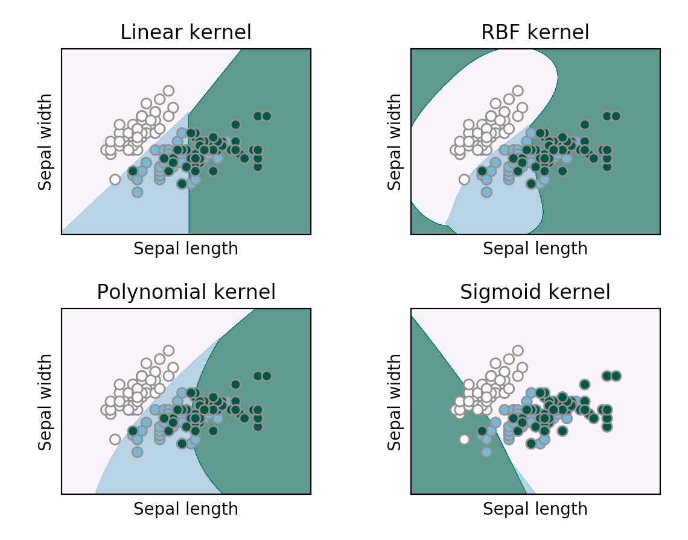
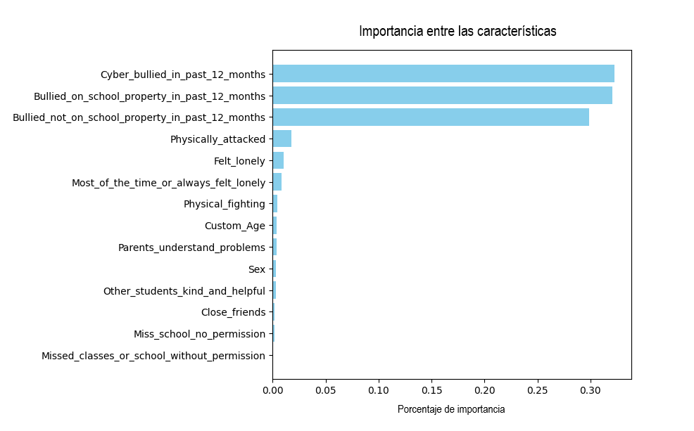

# Detección de casos de bullying

**Código del proyecto: BULL**

**Integrantes: Francisco Devaux (13848) y Bautista Frigolé (13675)**

## Introducción

En el presente informe se aborda un problema de _inteligencia artificial_, específicamente en el campo del aprendizaje automático y ciencia de datos. Nuestro objetivo es probar dos algoritmos (Random Forest y Support Vector Machine) y crear un _modelo de clasificación_, para que dado un dataset, éste sea capaz de identificar situaciones de bullying entre estudiantes, con el fin de prevenir y abordar este grave problema que afecta a los jóvenes.

Es importante primero explicar qué es el bullying. Este concepto define al acoso escolar, es decir a la conducta de persecución física y/o psicológica que realiza un estudiante contra otro de forma negativa, continua e intencionada [[1]](#bibliografía). Como hemos dicho, esta problemática no se debe tomar a la ligera, pues puede tener efectos negativos en la salud física, el bienestar emocional y el rendimiento académico de los niños, en especial si dicha violencia se repite en el tiempo o es severa [[2]](#bibliografía).

La elección de estos algoritmos responde a la necesidad de modelar relaciones no lineales, gestionar conjuntos de datos extensos y enfrentar posibles desequilibrios en la distribución de clases. Estos métodos destacan por su capacidad para manejar múltiples características y proporcionar resultados robustos, lo cual es esencial en un entorno tan diverso como el estudiantil.

No obstante, los modelos deben ser cuidadosamente ajustados y evaluados para garantizar resultados precisos y relevantes. Además, la interpretación de los resultados puede requerir consideraciones éticas y contextualización adecuada dada la naturaleza sensible de los datos de salud estudiantil.

A lo largo de este informe iremos explicando un marco teórico de cada uno de los algoritmos mencionados, el experimento práctico con la configuración y los resultados de los modelos. Además, concluiremos realizando una comparación de ambos modelos, teniendo en cuenta sus ventajas y desventajas, analizando cuál es el de uso más conveniente.

## Marco teórico

### Random Forest

**Árboles de decisión**

El algoritmo de Random Forest se compone de la construcción de múltiples árboles de decisión, un concepto que se explicará brevemente a continuación. Los árboles de decisión tienen como objetivo responder a preguntas de sí o no, como por ejemplo, "¿Debería un avión despegar?" A partir de ahí, realizan una serie de preguntas adicionales para determinar la respuesta, tales como "¿Hay tormenta eléctrica?" o "¿Hay grandes ráfagas de viento?".

Estas preguntas forman los nodos de decisión del árbol, cuyas respuestas conducen a nuevas preguntas hasta llegar a un nodo hoja que proporciona una respuesta de sí o no.

Este árbol de decisiones ejemplifica un problema de clasificación, donde las etiquetas de clase son "Despegar" y "No despegar". Aunque los árboles de decisión son algoritmos comunes de aprendizaje supervisado, pueden enfrentar problemas como sesgos y sobreajuste. No obstante, cuando varios árboles de decisión se combinan en el algoritmo de Random Forest, predicen resultados más precisos, especialmente cuando los árboles individuales no están correlacionados entre sí.

En la siguiente imagen podemos ver un ejemplo de árbol de decisión.

**Figura 1.**  Árbol de decisión acerca del hambre.

**Algoritmo de Random Forest**

Como mencionamos anteriormente, Random Forest genera múltiples árboles de decisión que se fusionan para mejorar la precisión de las predicciones.

La premisa subyacente del modelo de Random Forest es que diversos modelos no correlacionados (los árboles de decisión individuales) funcionan de manera más eficiente como conjunto que de forma individual. En el caso de la clasificación con Random Forest, cada árbol emite una clasificación o un "voto". El conjunto de árboles selecciona la clasificación con la mayoría de los "votos". En la regresión con Random Forest, el conjunto determina el promedio de las salidas de todos los árboles.

La clave reside en la baja (o nula) correlación entre los modelos individuales, es decir, entre los árboles de decisión que componen el conjunto general de Random Forest. Aunque los árboles individuales pueden cometer errores, la mayoría del conjunto tiende a ser precisa, orientando así el resultado general en la dirección correcta.

**Ventajas de Random Forest**

- **Robustez**: Random Forest es un algoritmo robusto que puede manejar datos ruidosos y valores atípicos. Tiene menos probabilidad de sobreajustar los datos, lo que significa que puede generalizar bien a nuevos datos.
- **Precisión**: Random Forest es uno de los algoritmos de aprendizaje automático más precisos. Puede manejar problemas de clasificación y regresión, así como trabajar bien con variables categóricas y continuas.
- **Velocidad**: A pesar de ser un algoritmo complejo, Random Forest es rápido y puede manejar conjuntos de datos grandes. También se puede paralelizar fácilmente para acelerar el entrenamiento.

**Desventajas de Random Forest**

- **Sobreajuste**: Aunque Random Forest es menos propenso al sobreajuste que un solo árbol de decisión, aún puede sobreajustar los datos si el número de árboles en el bosque es demasiado alto o si los árboles son demasiado profundos.
- **Interpretabilidad**: Random Forest puede ser menos interpretable que un solo árbol de decisión porque involucra múltiples árboles. Puede ser difícil entender cómo el algoritmo llegó a una predicción particular.

**Justificación de uso**

Las ventajas de Random Forest, tales como su robustez ante datos ruidosos, su capacidad para manejar variables categóricas y continuas, así como su velocidad de procesamiento, son elementos críticos en la resolución de un problema delicado como el bullying. Además, la capacidad de interpretar la importancia de las features en el modelo contribuye a la comprensión y contextualización adecuada de los resultados, considerando la naturaleza sensible de los datos de salud estudiantil.

### Support Vector Machine

Support Vector Machine (SVM) es un algoritmo de aprendizaje automático supervisado utilizado tanto para clasificación como para regresión, aunque se adapta mejor a la clasificación. El objetivo principal del algoritmo SVM es encontrar el hiperplano óptimo en un espacio N-dimensional que pueda separar los puntos de datos en diferentes clases en el espacio de características. El hiperplano intenta que el margen entre los puntos más cercanos de diferentes clases sea lo más amplio posible. La dimensión del hiperplano depende del número de características. Si el número de características de entrada es dos, entonces el hiperplano es simplemente una línea. Si el número de características de entrada es tres, entonces el hiperplano se convierte en un plano 2D. Y así sucesivamente. [[6]](#bibliografía)

Consideremos dos variables independientes x1, x2 y una variable dependiente que es un círculo azul o un círculo rojo.

**Figura 2.** Puntos linealmente separables. [[6]](#bibliografía)

En la figura anterior, hay múltiples líneas que dividen o realizan una clasificación entre círculos rojos y azules. Entonces, ¿cómo se elige la mejor línea o, en general, el mejor hiperplano que divida nuestros puntos de datos?

**¿Cómo funciona SVM?**

Una elección razonable para el mejor hiperplano es aquel que representa la mayor separación o margen entre las dos clases.

**Figura 3.** Múltiples hiperplanos separan los datos de dos clases. [[6]](#bibliografía)

Así que elegimos el hiperplano cuya distancia desde él hasta el punto de datos más cercano en cada lado esté maximizada. Si existe tal hiperplano, se conoce como el hiperplano de margen máximo (Margen Duro). Entonces, de la figura anterior, elegimos L2.

Consideremos un escenario como se muestra a continuación.

**Figura 4.** Selección de hiperplano para datos con valores atípicos. [[6]](#bibliografía)

Aquí tenemos un círculo azul en la zona de los círculos rojos. ¿Cómo clasifica SVM los datos? El círculo azul en esa zona es un valor atípico de las bolas azules. El algoritmo SVM tiene la característica de ignorar el valor atípico y encuentra el mejor hiperplano que maximiza el margen (Margen Suave).

**Datos linealmente no separables**

Hasta ahora, estábamos hablando de datos linealmente separables (el grupo de círculos azules y rojos es separable por una recta). ¿Qué hacer si los datos no son linealmente separables?

**Figura 5.** Conjunto de datos en una dimensión. [[6]](#bibliografía)

Digamos que nuestros datos se muestran en la figura anterior. SVM resuelve esto creando una nueva variable mediante un kernel. Llamamos a un punto xi en la línea y creamos una nueva variable yi como una función de la distancia desde el origen. Entonces, si representamos esto, obtenemos algo así como se muestra a continuación.

**Figura 6.** Mapeo de datos de una a dos dimensiones. [[6]](#bibliografía)

En este caso, la nueva variable y se crea como una función de la distancia desde el origen. Una función no lineal que crea una nueva variable se denomina kernel.

**Terminología**

- **Hiperplano:** El hiperplano es la frontera de decisión que se utiliza para separar los puntos de datos de diferentes clases en un espacio de características. En el caso de clasificaciones lineales, será una ecuación lineal, es decir, wx+b = 0.

- **Vectores de Soporte:** Los vectores de soporte son los puntos de datos más cercanos al hiperplano, que desempeñan un papel crítico en la decisión del hiperplano y el margen.

- **Margen:** El margen es la distancia entre el vector de soporte y el hiperplano. El objetivo principal del algoritmo de la máquina de vectores de soporte es maximizar el margen. Un margen más amplio indica un mejor rendimiento de clasificación.

- **Kernel:** El kernel es la función matemática que se utiliza en SVM para mapear los puntos de datos de entrada originales en espacios de características de alta dimensión, de modo que el hiperplano pueda encontrarse fácilmente incluso si los puntos de datos no son linealmente separables en el espacio de entrada original. Algunas de las funciones de kernel comunes son lineales, polinómicas, de función de base radial (RBF) y sigmoide.

- **Margen Duro:** El hiperplano de margen máximo o el hiperplano de margen duro es un hiperplano que separa adecuadamente los puntos de datos de diferentes categorías sin ninguna clasificación errónea.

- **Margen Suave:** Cuando los datos no son perfectamente separables o contienen valores atípicos, SVM permite una técnica de margen suave. Cada punto de datos tiene una variable de holgura introducida por la formulación SVM de margen suave, que suaviza el estricto requisito de margen y permite ciertas clasificaciones erróneas o violaciones. Descubre un compromiso entre aumentar el margen y reducir las violaciones.

- **C:** La maximización del margen y las penalizaciones por clasificación errónea se equilibran mediante el parámetro de regularización C en SVM. Decide la penalización por cruzar el margen o clasificar incorrectamente los puntos de datos. Un valor mayor de C impone una penalización más estricta, lo que resulta en un margen más pequeño y posiblemente menos clasificaciones erróneas.

**Funciones de Kernel Populares en SVM**

El kernel de SVM es una función que toma un espacio de entrada de baja dimensión y lo transforma en un espacio de mayor dimensión, es decir, convierte problemas no separables en problemas separables. Es especialmente útil en problemas de separación no lineal. En pocas palabras, el kernel realiza transformaciones de datos extremadamente complejas y luego descubre el proceso para separar los datos en función de las etiquetas o salidas definidas.

$$\text{Lineal: } K(w,b) = w^Tx+b$$

$$\text{Gaussiano RBF: } K(w,x) = \exp(-\gamma|| x_i-x_j||^n)$$

$$\text{Polinomial: } K(w,x) = (\gamma w^Tx+b)^N$$

$$\text{Sigmoide:} K(x_i, x_j) = \tanh(\alpha x_i^Tx_j + b)$$

**Figura 7.** Representación gráfica de los distintos tipos de kernel de SVM. [[7]](#bibliografía)

**Demostración Visual**

En el siguiente video se puede observar un conjunto de puntos azules y rojos que no son linealmente separables. Pero, al utilizar un kernel polinomial, se puede transformar el conjunto de datos en un espacio de características de mayor dimensión, donde los puntos de datos se pueden separar fácilmente utilizando un hiperplano.

**Figura 8.** Demostración visual del truco del kernel en SVM. [[8]](#bibliografía)

**Ventajas de SVM**

- Eficiente en espacios de alta dimensión, con muchas features.

- Buen rendimiento en problemas no lineales, mediante el uso de kernels, SVM puede manejar eficientemente problemas de clasificación no lineales.

- SVM busca maximizar el margen entre las clases, lo que generalmente resulta en modelos más generalizables.

- SVM es robusto ante la presencia de valores atípicos en el conjunto de datos.

**Desventajas de SVM**

- Ineficiente en grandes conjuntos de datos, SVM puede volverse computacionalmente costoso y requerir mucho tiempo de entrenamiento.

- Las decisiones tomadas por un modelo SVM pueden ser difíciles de interpretar y visualizar, especialmente en espacios de alta dimensión.

- SVM puede ser sensible a la escala de las características, por lo que a menudo se requiere el escalamiento de características antes del entrenamiento.

**Justificación de uso**

En primer lugar, SVM destaca por su capacidad para manejar eficazmente relaciones no lineales en los datos, gracias al uso de funciones kernel. En este contexto donde las relaciones entre las características pueden ser complejas y no lineales, esta propiedad permite capturar patrones más sutiles y, en consecuencia, mejorar la precisión del modelo.

Además, SVM busca el hiperplano que maximiza el margen entre las clases. Este enfoque de "margen máximo" contribuye a una buena generalización del modelo y, por ende, a un rendimiento sólido en datos de prueba no vistos.

La robustez de SVM ante outliers en los datos es otra ventaja significativa. Dado que los conjuntos de datos del mundo real a menudo contienen datos atípicos o anomalías, la capacidad de SVM para manejar estos casos sin comprometer significativamente el rendimiento general del modelo es otro aspecto beneficioso.

Finalmente, la regularización incorporada en SVM a través del parámetro C proporciona un mecanismo para equilibrar la complejidad del modelo y la clasificación errónea en el conjunto de entrenamiento. Este control sobre la flexibilidad del modelo es esencial para adaptar SVM a las características específicas del conjunto de datos.

### Boosting

El boosting es una técnica de modelado de conjuntos que intenta construir un clasificador fuerte a partir de una cantidad de clasificadores débiles. En primer lugar, se construye un modelo a partir de los datos de entrenamiento. Luego se construye el segundo modelo que intenta corregir los errores presentes en el primer modelo. Este procedimiento continúa y se agregan modelos hasta que se predice correctamente el conjunto de datos de entrenamiento completo o se agrega el número máximo de modelos. [[9]](#bibliografía)

#### ADA Boosting

El algoritmo AdaBoost (Adaptive Boosting). A dicho algoritmo se le llama adaptativo porque se vuelven a asignar los pesos de las clases a cada instancia, asignando pesos más altos a las instancias clasificadas incorrectamente.
Inicialmente este algoritmo constuye un modelo y da pesos iguales a todas las clases. Luego, se le asigna peso más alto a la clase que fue peor clasificada. Por lo tanto, el siguiente modelo hará mayor foco en esta clase. Y así continuará entrenando modelos hasta que llegue un error más bajo. [[10]](#bibliografía)

**Figura 9.** Ejemplo de AdaBoost. [[11]](#bibliografía)

### Curvas de Aprendizaje

Las curvas de aprendizaje son una herramienta muy útil para determinar si un modelo está sufriendo de overfitting o underfitting. Estas curvas representan la precisión del modelo en el conjunto de entrenamiento y en el conjunto de validación en función del tamaño del conjunto de entrenamiento.

Dos conceptos importantes relacionados a las curvas de aprendizaje son el sesgo (bias) y la varianza (variance).

**Sesgo**

El sesgo es el error debido a suposiciones incorrectas en el algoritmo de aprendizaje. Un alto sesgo puede causar que el algoritmo ignore los detalles relevantes y haga suposiciones demasiado simples. El sesgo alto puede conducir a un underfitting.

**Figura 10.** Curvas de aprendizaje con sesgo alto y bajo.  [[12]](#bibliografía)

**Varianza**

La varianza es el error debido a la sensibilidad excesiva a pequeñas fluctuaciones en el conjunto de entrenamiento. Un modelo con una alta varianza se ajusta demasiado a los datos de entrenamiento y no generaliza bien para predecir nuevos datos. La alta varianza puede conducir a un overfitting.

**Figura 11.** Curvas de aprendizaje con varianza baja y alta.  [[12]](#bibliografía)

## Diseño Experimental

### Dataset

Hemos empleado el [dataset](https://www.kaggle.com/datasets/leomartinelli/bullying-in-schools) del Global School-Based Student Health Survey (GSHS) realizado en Argentina en 2018. El GSHS es una encuesta basada en escuelas que utiliza un cuestionario autoadministrado para recopilar datos sobre el comportamiento de salud de los jóvenes y los factores protectores relacionados con las principales causas de morbilidad y mortalidad. En la edición realizada en Argentina en 2018, participaron un total de 56,981 estudiantes.

**Features:**

- **Bullied on school property in past 12 months**: Sufrió bullying en la escuela en los últimos 12 meses (Si, No).
- **Bullied not on school property in past 12_months**: Sufrió bullying fuera de la escuela en los últimos 12 meses (Si, No).
- **Cyber bullied in past 12 months**: Sufrió ciberbullying en los últimos 12 meses (Si, No).
- **Custom Age**: Edad del estudiante.
- **Sex**: Sexo del estudiante.
- **Physically attacked**: Cantidad de veces que fue atacado físicamente.
- **Physical fighting**: Cantidad de veces que peleó físicamente.
- **Felt lonely**: Se sintió solo/a (Siempre, la mayoría de las veces, algunas veces, nunca).
- **Close friends**: Cantidad de amigos cercanos.
- **Miss school no permission**: Cantidad de veces que faltó a la escuela sin permiso.
- **Other students kind and helpful**: Sintió que otros estudiantes fueron amables y serviciales (Siempre, la mayoría de las veces, algunas veces, nunca).
- **Parents understand problems**: Sintió que sus padres entendieron sus problemas (Siempre, la mayoría de las veces, algunas veces, nunca).
- **Most of the time or always felt lonely**: Se sintió solo/a la mayoría de las veces o siempre (Si, No).
- **Missed classes or school without permission**: Faltó a clases o a la escuela sin permiso (Si, No).
- **Were underweight**: Estuvo por debajo del peso.
- **Were overweight**: Estuvo por encima del peso.
- **Were obese**: Sufrió obesidad.

### Preprocesamiento y análisis exploratorio de datos

Hemos decidido crear una única feature referida al bullying: 'Bullied_in_past_12_months', la cual es la combinación de las otras 3 features referidas al bullying:

- Bullied_on_school_property_in_last_12_months,
- Bullied_not_on_school_property_in_last_12_months y
- Cyber_Bullied_in_last_12_months;

si alguno de estos es true, Bullied_in_last_12_months es true.

Obteniendo así la siguiente distribución de las clases 'No sufrió bullying' y 'Sufrió bullying':

- (0) 'No sufrió bullying', si no han sufrido bullying en los últimos 12 meses y
- (1) 'Sufrió bullying', en caso contrario.

Esta decisión se tomó para mejorar el balance de las clases, ya que como se puede ver en la imagen, las tres clases por separado presentan un desbalanceo importante.

**Figura 12.** Distribución de los tipos de bullying.

Distribución del bullying según sexo:

**Figura 13.** Cantidad de estudiantes que sufrieron bullying según sexo.

Distribución del bullying según si se sienten solos:

**Figura 14.** Cantidad de estudiantes que sufrieron bullying según si se sentían solos.

**Correlación con Cramer's V**

Posteriormente, se realizó un análisis de correlación entre las variables para determinar cuáles son las más relevantes para el modelo. Para ello, se utilizó el índice de correlación de Cramer's V, el cual es una medida de asociación entre variables categóricas. Este índice se encuentra entre 0 y 1, donde 0 indica que no hay asociación entre las variables y 1 indica una asociación perfecta.

Índice de correlación de Cramer's V entre cada una de las variables y Bullied_in_past_12_months.

**Figura 15.** Índice de correlación de Cramer's V entre cada variable y Bullied_in_past_12_months.

**Matriz de correlación**

Se calculó también la matriz de correlación entre las variables. En la matriz de correlación se utiliza el coeficiente de correlación de Pearson, el cual es una medida de la fuerza de una relación lineal entre dos variables cuantitativas. Este coeficiente se encuentra entre -1 y 1, donde 0 indica que no hay asociación entre las variables y 1 indica una asociación perfecta.

**Figura 16.** Matriz de correlación entre las variables.

**Importancia de Features de Random Forest**

Finalmente, se detalla la importancia de las variables según la función provista por Random Forest.

**Figura 17.** Importancia de las variables según Random Forest.

En base a los resultados obtenidos, se probó agregar nuevas features en base a las existentes, como por ejemplo: Has_close_friends a partir de Close_friends, que sería True si Close_friends es un número mayor a 0, pero éste empeoraba su valor de correlación de Cramer's V con respecto a Close_friends.

Además, 'Most_of_the_time_or_always_felt_lonely' y 'Missed_classes_or_school_without_permission', que venían incluídas en el dataset, también son features que fueron creadas en base a 'Felt_lonely' y 'Miss_school_no_permission', pero como se puede observar no aportan mejor correlación que éstas, así que también se descartan.

Después de analizar la correlación de los datos con los métodos ya mencionados y experimentar con diversas combinaciones de features con el objetivo de maximizar los resultados a través de la implementación de los modelos, se ha determinado la utilización de las siguientes variables:

- Bullied_in_past_12_months
- Physically_attacked
- Physical_fighting
- Felt_lonely
- Sex

### Random Forest

Para la implementación del Random Forest, se emplearon los siguientes parámetros:

- `n_estimators=100`: El número de árboles en el bosque.

- `criterion='gini'`: La función para medir la calidad de un split.

- `max_depth=None`: La profundidad máxima del árbol. Si es `None`, los nodos se expanden hasta que todas las hojas sean puras o hasta que todas las hojas contengan menos de `min_samples_split` ejemplos.

- `min_samples_split=2`: El número mínimo de muestras necesario para dividir un nodo interno.

- `max_features='sqrt'`: El número de características a considerar al buscar la mejor división (sqrt(n_features)).

- `bootstrap=False`: Si se utilizan o no muestras de arranque al construir los árboles. Si es `False`, se utiliza todo el conjunto de datos para construir cada árbol.

- `class_weight={0: 1, 1: 1.5}`: Pesos asociados con las clases {No sufrió bullying: 1, Sufrió bullying: 1.5}.

#### Train

**Matriz de confusión**

|                        | No sufrió bullying **(Predecido)** | Sufrió bullying **(Predecido)**|
| ---------------------- | --------------------- | ----------------- |
| **No sufrió bullying (Real)** | 16543                 | 8119              |
| **Sufrió bullying (Real)**    | 6009                  | 10217             |

**Reporte de la clasificación**

|                 | Precision | Recall | F1-Score | Support |
| --------------- | --------- | ------ | -------- | ------- |
| **Not bullied** | 0.73      | 0.67   | 0.70     | 24662   |
| **Bullied**     | 0.56      | 0.63   | 0.59     | 16226   |
| **Accuracy**    |           |        | 0.65     | 40888   |

#### Test

**Matriz de confusión**

|                        | No sufrió bullying **(Predecido)** | Sufrió bullying **(Predecido)**|
| ---------------------- | --------------------- | ----------------- |
| **No sufrió bullying (Real)** | 4043                  | 2055              |
| **Sufrió bullying (Real)**     | 1475                  | 2649              |

**Reporte de la clasificación**

|                 | Precision | Recall | F1-Score | Support |
| --------------- | --------- | ------ | -------- | ------- |
| **Not bullied** | 0.73      | 0.66   | 0.70     | 6098    |
| **Bullied**     | 0.56      | 0.64   | 0.60     | 4124    |
| **Accuracy**    |           |        | 0.65     | 10222   |

#### Configuración de parámetros de Random Forest

Generamos gráficos con el propósito de identificar la combinación óptima de la cantidad de árboles a utilizar en el modelo Random Forest, junto con los mejores pesos para las clases respectivas.

**Figura 18.** Accuracy según el número de árboles y los pesos de las clases.

**Figura 19.** Recall según el número de árboles y los pesos de las clases.

Al analizar los resultados, observamos que no hubo una mejora significativa al aumentar el número de árboles, por lo que decidimos mantener n=100. En cuanto a los pesos de las clases, optamos por una opción equilibrada entre el accuracy y el recall, seleccionando los siguientes pesos:

- No sufrió bullying: 1
- Sufrió bullying: 1.5

(representados por la curva verde).

### Support Vector Machine

Para la implementación de SVM se emplearon los siguientes parámetros:

- `C=10`: El parámetro C controla la penalización por error en la clasificación. Un valor más alto de C hará que el modelo sea más estricto, tratando de clasificar correctamente todos los puntos de entrenamiento, pero puede llevar a overfitting.

- `kernel='rbf'`: Especifica el tipo de kernel a utilizar en el algoritmo. Se utiliza un kernel radial, que es comúnmente utilizado en problemas no lineales.

- `gamma= 0.001`: El parámetro gamma controla la amplitud de la función del kernel. Un valor bajo de gamma produce una función del kernel más suave, mientras que un valor alto puede llevar a overfitting.

- `probability=True`: Este parámetro habilita el cálculo de probabilidades de pertenencia a cada clase.

- `class_weight={0: 1, 1: 1.5}`: Pesos asociados con las clases {No sufrió bullying: 1, Sufrió bullying: 1.5}.

#### Train

**Matriz de confusión**

|                        | No sufrió bullying **(Predecido)** | Sufrió bullying **(Predecido)**|
| ---------------------- | --------------------- | ----------------- |
| **No sufrió bullying (Real)** | 16664                 | 7998              |
| **Sufrió bullying (Real)**     | 7543                  | 8683              |

**Reporte de la clasificación**

|                 | Precision | Recall | F1-Score | Support |
| --------------- | --------- | ------ | -------- | ------- |
| **No sufrió bullying (Real)** | 0.69      | 0.68   | 0.68     | 24662   |
| **Sufrió bullying (Real)**     | 0.52      | 0.54   | 0.53     | 16226   |
| **Accuracy**    |           |        | 0.62     | 40888   |

#### Test

**Matriz de confusión**

|                        | No sufrió bullying **(Predecido)**| Sufrió bullying **(Predecido)**|
| ---------------------- | --------------------- | ----------------- |
| **No sufrió bullying (Real)** | 4161                  | 1937              |
| **Sufrió bullying (Real)**     | 1882                  | 2242              |

**Reporte de la clasificación**

|                 | Precision | Recall | F1-Score | Support |
| --------------- | --------- | ------ | -------- | ------- |
| **No sufrió bullying** | 0.69      | 0.68   | 0.69     | 6098    |
| **Sufrió bullying**     | 0.54      | 0.54   | 0.54     | 4124    |
| **Accuracy**    |           |        | 0.63     | 10222   |

#### Configuración de parámetros de SVM

Se generaron gráficos que representan el accuracy y el recall en función del factor de penalización (C) de SVM, utilizando 15 splits diferentes.

**Figura 20.** Accuracy según el factor de penalización (C) para SVM con 15 splits distintos.

**Figura 21.** Recall según el factor de penalización (C) para SVM con 15 splits distintos.

A partir de estos resultados, se seleccionó el valor de c=10, ya que demostró ser la elección que logra el mejor equilibrio entre ambas métricas.

De la misma manera, generamos gráficos con el propósito de identificar la combinación óptima del valor de gamma junto con los mejores pesos para las clases respectivas.

**Figura 22.** Accuracy según el valor de gamma y los pesos de las clases.

**Figura 23.** Recall según el valor de gamma y los pesos de las clases.

Al analizar los resultados, hemos elegido nuevamente una opción equilibrada entre el accuracy y el recall, seleccionando gamma= 0.001 y los siguientes pesos:

- No sufrió bullying: 1
- Sufrió bullying: 1.5

(representados por la curva verde).

## Análisis y discusión de resultados

### Comparacion de ambos algoritmos

Aquí se muestran gráficos de cajas comparativos para cada algoritmo, abarcando 30 divisiones diferentes. Estos gráficos proporcionan una visión completa de las métricas clave, como precision, recall, F1-score y accuracy, permitiendo evaluar el rendimiento de los algoritmos en diversos escenarios de división de datos.

**Random Forest**

**Figura 24.** Métricas en los resultados de test de Random Forest con 30 splits distintos.

**Support Vector Machine**

**Figura 25.** Métricas en los resultados de test de SVM con 30 splits distintos.

Como se puede observar, el algortimo de Random Forest obtiene resultados levemente mejores que SVM en accuracy y precision, y una mejoría considerable en recall y F1-Score.

#### Tiempo de ejecución

En el siguiente gráfico, se puede observar una comparación del tiempo de ejecución de los algoritmos Random Forest y Support Vector Machine.

**Figura 26.** Tiempo de ejecución de 10 ejecuciones de Random Forest y SVM.

Como podemos apreciar, el tiempo de ejecución de SVM es considerablemente mayor que el de Random Forest. Esto se debe a que SVM es un algoritmo más complejo que Random Forest, ya que utiliza un kernel para transformar los datos de entrada en un espacio de características de mayor dimensión, lo que requiere un mayor tiempo de ejecución.

#### Curvas de aprendizaje para Random Forest

**Figura 27.** Curva de aprendizaje de Random Forest.

Como se puede obsevar, el modelo presenta un sesgo alto, por lo que agregar más datos de entrenamiento no va a mejorar los resultados.
Luego de investigar, hemos identificado que las posibles causas de dicho incoveniente pueden ser las siguientes:

- **Features no informativas:** Si las features utilizadas por el modelo no son informativas o no capturan la verdadera estructura de los datos, el modelo puede tener un sesgo alto.

- **Sobre simplificación:** Un sesgo alto también puede ocurrir cuando se simplifican en exceso ciertos aspectos del modelo para facilitar el aprendizaje, pero esto puede llevar a una representación inexacta de los datos.

- **Underfitting:** Ocurre cuando el modelo no es lo suficientemente complejo como para adaptarse a los patrones subyacentes en los datos de entrenamiento.

En base a esto, se optó por implementar las siguientes estrategias para solucionar esta situación. Las cuales fueron Boosting y la adición de features a RF.

#### Boosting

Al implementar el algoritmo ADA Boosting obtuvimos los siguientes resultados.

**Figura 28.** Curva de aprendizaje de Random Forest con ADA Boost.

Podemos observar en el gráfico que no muestra una mejora significativa comparado con el modelo sin boost. Por lo cual esta solución queda descartada.

**Adición de features**

La otra causa podía ser que se simplificaban en exceso ciertos aspectos del modelo. Por lo que se optó por agregar más features al modelo de Random Forest con el objetivo de reducir el sesgo.

Se agregaron las siguientes features:

- Miss_school_no_permission
- Other_students_kind_and_helpful
- Parents_understand_problems

Obteniendo los siguientes resultados:

**Figura 29.** Curva de aprendizaje de Random Forest con nuevas features.

Como se puede observar, el modelo presenta un sesgo menor que el modelo anterior. Por lo que se puede concluir que la causa del sesgo alto era la falta de features informativas. Sin embargo, esta elección de features empeora considerablemente el puntaje obtenido en las metricas comparado con el modelo anterior. Esto se puede observar en el siguiente gráfico de cajas.

**Figura 30.** Métricas en los resultados de test de Random Forest con 30 splits distintos con nuevas features.

## Conclusión

En este proyecto, abordamos la problemática de la detección de casos de bullying en estudiantes mediante el uso de algoritmos de aprendizaje automático aplicados al dataset generado a partir de la GSHS. Los algoritmos elegidos fueron Random Forest y Support Vector Machine (SVM).

Durante el EDA, tomamos decisiones fundamentales, como la creación de una única característica para representar el bullying y la selección de variables relevantes. También exploramos la correlación entre las variables y la importancia de las características según Random Forest.

En la implementación de los modelos, ajustamos cuidadosamente los parámetros, considerando aspectos como la cantidad de árboles en Random Forest y el parámetro C en SVM. Realizamos una comparación exhaustiva de ambos algoritmos, evaluando métricas clave como precisión, recall, F1-Score y accuracy.

Random Forest demostró un rendimiento generalmente superior a SVM en todas las métricas evaluadas. La capacidad de Random Forest para manejar relaciones no lineales y su rendimiento robusto lo posicionan como una elección efectiva para este problema.

SVM, a pesar de tener una mayor complejidad computacional, presentó resultados inferiores a los de Random Forest, teniendo en cuenta la puntuación en las métricas y la enorme diferencia en los tiempos de ejecución.

En la evaluación de sesgo y varianza, identificamos que Random Forest inicialmente mostró un sesgo alto, que abordamos mediante la adición de features al modelo. Sin embargo, esta mejora en el sesgo vino acompañada de una disminución en las métricas de rendimiento. La implementación de boosting mediante el algoritmo AdaBoost no proporcionó mejoras significativas.

Para finalizar, cabe mencionar que este proyecto destaca la complejidad de abordar problemas de salud estudiantil utilizando aprendizaje automático y subraya la importancia de considerar cuidadosamente las decisiones de modelado. Aunque Random Forest presentó resultados decentes, queda abierta la posibilidad de investigar otros algoritmos adecuados para esta problemática.

## Bibliografía

- [1] UNICEF. [¿Cómo prevenir el acoso escolar?](https://www.unicef.es/acoso-escolar-bullying)
- [2] Save the Children. [Bullying o acoso escolar](https://www.savethechildren.es/donde/espana/violencia-contra-la-infancia/acoso-escolar-bullying)
- [3] IBM. [¿Qué es el random forest?](https://www.ibm.com/mx-es/topics/random-forest#:~:text=El%20random%20forest%20es%20un,problemas%20de%20clasificaci%C3%B3n%20y%20regresi%C3%B3n)
- [4] CareerFoundry. [What is random forest?](https://careerfoundry.com/en/blog/data-analytics/what-is-random-forest/)
- [5] Rebellion Research. [What Are The Advantages And Disadvantages Of Random Forest?](https://www.rebellionresearch.com/what-are-the-advantages-and-disadvantages-of-random-forest)
- [6] GeeksForGeeks. (2023). [Support Vector Machine (SVM) Algorithm](https://www.geeksforgeeks.org/support-vector-machine-algorithm/)
- [7] Premanand S. (2023). [The A-Z guide to Support Vector Machine](https://www.analyticsvidhya.com/blog/2021/06/support-vector-machine-better-understanding/)
- [8] Udiprod. (2021). [SVM with polynomial kernel visualization (HD)](https://www.youtube.com/watch?v=OdlNM96sHio&ab_channel=udiprod)
- [9] GeeksForGeeks. (2023). [Boosting in Machine Learning | Boosting and AdaBoost.](https://www.geeksforgeeks.org/boosting-in-machine-learning-boosting-and-adaboost/?ref=header_search)
- [10] Saini, Anshul. (2023). [AdaBoost Algorithm: Understand, Implement and Master AdaBoost](https://www.analyticsvidhya.com/blog/2021/09/adaboost-algorithm-a-complete-guide-for-beginners/)
- [11] Alto, Valentina. (2020). [Understanding AdaBoost for Decision Tree](https://towardsdatascience.com/understanding-adaboost-for-decision-tree-ff8f07d2851)
- [12] Olteanu, Alex. (2018). [Tutorial: Learning Curves for Machine Learning in Python](https://www.dataquest.io/blog/learning-curves-machine-learning/)
