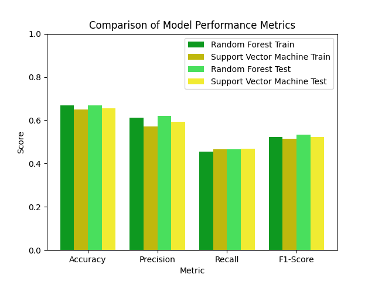

# Random Forest vs Support Vector Machine

# Random Forest

A partir de una implementación de random forest con las siguientes features:

- Bullied_in_past_12_months
- Physically_attacked
- Physical_fighting
- Felt_lonely

Y prediciendo la columna 'Bullied_in_past_12_months', generando 250 arboles, se obtuvieron los siguientes resultados:

## Train

### Matriz de confusión

|              | Predicted 0 | Predicted 1 |
| ------------ | ----------- | ----------- |
| **Actual 0** | 19865       | 4746        |
| **Actual 1** | 8752        | 7525        |

### Reporte de la clasificación

|                  | Precision | Recall | F1-Score | Support |
| ---------------- | --------- | ------ | -------- | ------- |
| **Class 0**      | 0.69      | 0.81   | 0.75     | 24611   |
| **Class 1**      | 0.61      | 0.46   | 0.53     | 16277   |
| **Accuracy**     |           |        | 0.67     | 40888   |
| **Macro Avg**    | 0.65      | 0.63   | 0.64     | 40888   |
| **Weighted Avg** | 0.66      | 0.67   | 0.66     | 40888   |

## Test

### Matriz de confusión

|              | Predicted 0 | Predicted 1 |
| ------------ | ----------- | ----------- |
| **Actual 0** | 5012        | 1137        |
| **Actual 1** | 2226        | 1847        |

### Reporte de la clasificación

|                  | Precision | Recall | F1-Score | Support |
| ---------------- | --------- | ------ | -------- | ------- |
| **Class 0**      | 0.69      | 0.82   | 0.75     | 6149    |
| **Class 1**      | 0.62      | 0.45   | 0.52     | 4073    |
| **Accuracy**     |           |        | 0.6710   | 10222   |
| **Macro Avg**    | 0.66      | 0.63   | 0.64     | 10222   |
| **Weighted Avg** | 0.66      | 0.67   | 0.66     | 10222   |

### Gráficos

Tras ejecutarlo con distintos subconjuntos del dataset se obtuvieron los siguientes resultados:

# Support Vector Machine

A partir de una implementación de SVM con las siguientes features:

- 'Bullied_in_past_12_months'
- 'Sex'
- 'Felt_lonely'
- 'Close_friends'
- 'Other_students_kind_and_helpful'
- 'Parents_understand_problems'
- 'Physically_attacked'
- 'Physical_fighting'
- 'Miss_school_no_permission'

Prediciendo la columna 'Bullied_in_past_12_months', utilizando los siguientes parámetros:

- kernel='rbf': Se utiliza un kernel radial, que es comúnmente utilizado en problemas no lineales.

- C=1: El parámetro C controla la penalización por error en la clasificación. Un valor más alto de C hará que el modelo sea más estricto, tratando de clasificar correctamente todos los puntos de entrenamiento, pero puede llevar a overfitting.

- gamma='auto': El parámetro gamma controla la amplitud de la función kernel. En este caso, se establece en 'auto', lo que significa que se utilizará 1/n_features. Un valor bajo de gamma produce una función kernel más suave, mientras que un valor alto puede llevar a overfitting.

- probability=True: Este parámetro habilita el cálculo de probabilidades de pertenencia a cada clase.

## Train

### Matriz de confusión

|              | Predicted 0 | Predicted 1 |
| ------------ | ----------- | ----------- |
| **Actual 0** | 20650       | 3951        |
| **Actual 1** | 9431        | 6856        |

### Reporte de la clasificación

|                  | Precision | Recall | F1-Score | Support |
| ---------------- | --------- | ------ | -------- | ------- |
| **Class 0**      | 0.69      | 0.84   | 0.76     | 24601   |
| **Class 1**      | 0.63      | 0.42   | 0.51     | 16287   |
| **Accuracy**     |           |        | 0.67     | 40888   |
| **Macro Avg**    | 0.66      | 0.63   | 0.63     | 40888   |
| **Weighted Avg** | 0.67      | 0.67   | 0.66     | 40888   |

## Test

### Matriz de confusión

|              | Predicted 0 | Predicted 1 |
| ------------ | ----------- | ----------- |
| **Actual 0** | 5151        | 1008        |
| **Actual 1** | 2379        | 1684        |

### Reporte de la clasificación

|                  | Precision | Recall | F1-Score | Support |
| ---------------- | --------- | ------ | -------- | ------- |
| **Class 0**      | 0.68      | 0.84   | 0.75     | 6159    |
| **Class 1**      | 0.63      | 0.41   | 0.50     | 4063    |
| **Accuracy**     |           |        | 0.67     | 10222   |
| **Macro Avg**    | 0.65      | 0.63   | 0.63     | 10222   |
| **Weighted Avg** | 0.66      | 0.67   | 0.65     | 10222   |

# Comparación de métricas de los modelos

