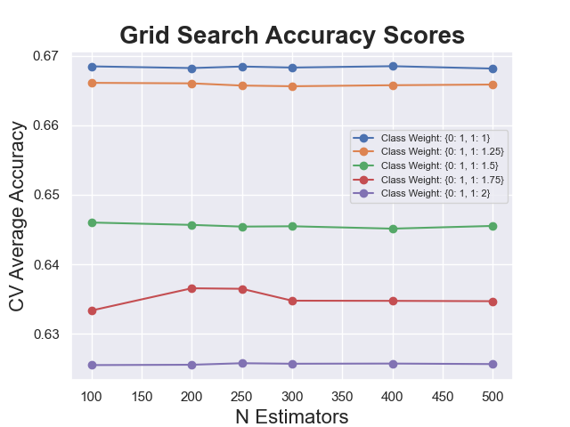
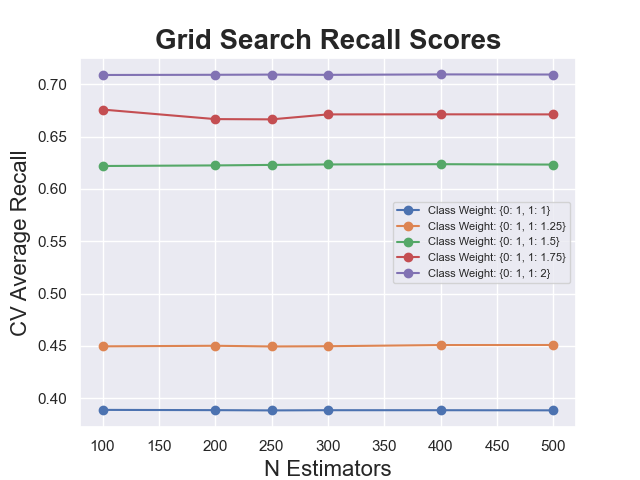
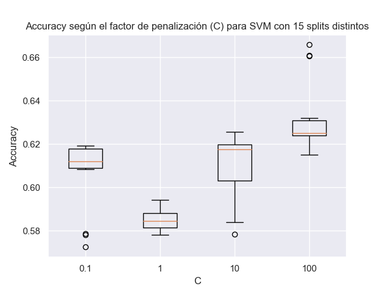
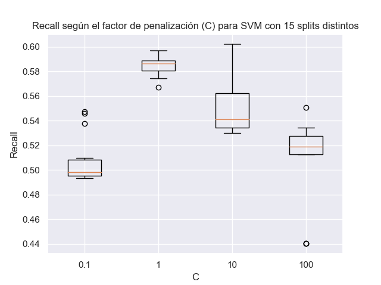
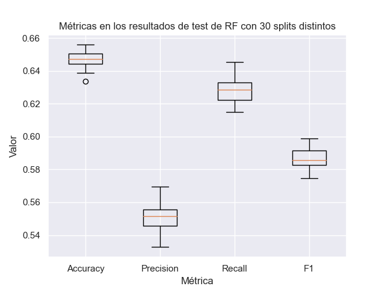
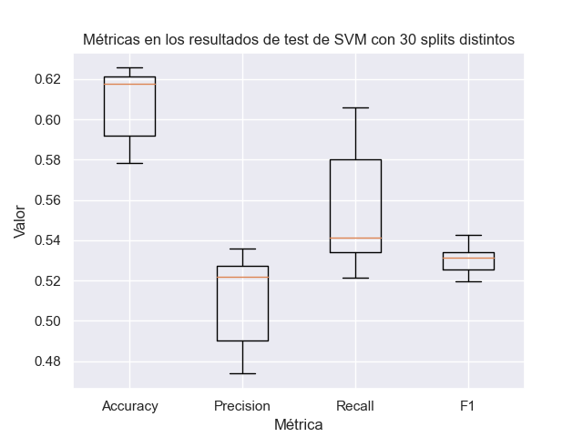

# Random Forest vs Support Vector Machine

Se utilizaron los algoritmos de Random Forest y Support Vector Machine para predecir la columna 'Bullied_in_past_12_months' del dataset, clasificando a los estudiantes en dos clases: 'Bullied' si sufrieron bullying en los últimos 12 meses y 'Not_bullied', en caso contrario.

'Bullied_in_past_12_months' se crea a partir de combinar otras 3 features referidas al bullying: Bullied_on_school_property_in_last_12_months, Bullied_not_on_school_property_in_last_12_months y Cyber_Bullied_in_last_12_months; si alguno de los 3 es true Bullied_in_last_12_months es true.

# Random Forest

Para la implementación del Random Forest, se emplearon los siguientes parámetros:

- `n_estimators=100`: El número de árboles en el bosque.

- `criterion='gini'`: La función para medir la calidad de un split.

- `max_depth=None`: La profundidad máxima del árbol. Si es `None`, los nodos se expanden hasta que todas las hojas sean puras o hasta que todas las hojas contengan menos de `min_samples_split` ejemplos.

- `min_samples_split=2`: El número mínimo de muestras necesario para dividir un nodo interno.

- `max_features='sqrt'`: El número de características a considerar al buscar la mejor división (sqrt(n_features)).

- `bootstrap=False`: Si se utilizan o no muestras de arranque al construir los árboles. Si es `False`, se utiliza todo el conjunto de datos para construir cada árbol.

- `class_weight={0: 1, 1: 1.5}`: Pesos asociados con las clases {Not bullied: 1, Bullied: 1.5}.

## Train

### Matriz de confusión

|              | Predicted Not bullied | Predicted Bullied |
| ------------ | ----------- | ----------- |
| **Actual Not bullied** | 16543       | 8119        |
| **Actual Bullied** | 6009        | 10217        |

### Reporte de la clasificación

|                  | Precision | Recall | F1-Score | Support |
| ---------------- | --------- | ------ | -------- | ------- |
| **Not bullied**      | 0.73      | 0.67   | 0.70     | 24662   |
| **Bullied**      | 0.56      | 0.63   | 0.59     | 16226   |
| **Accuracy**     |           |        | 0.65     | 40888   |
| **Macro Avg**    | 0.65      | 0.65   | 0.65     | 40888   |
| **Weighted Avg** | 0.66      | 0.65   | 0.66     | 40888   |

## Test

### Matriz de confusión

|              | Predicted Not bullied | Predicted Bullied |
| ------------ | ----------- | ----------- |
| **Actual Not bullied** | 4043        | 2055        |
| **Actual Bullied** | 1475        | 2649        |

### Reporte de la clasificación

|                  | Precision | Recall | F1-Score | Support |
| ---------------- | --------- | ------ | -------- | ------- |
| **Not bullied**      | 0.73      | 0.66   | 0.70     | 6098    |
| **Bullied**      | 0.56      | 0.64   | 0.60     | 4124    |
| **Accuracy**     |           |        | 0.65     | 10222   |
| **Macro Avg**    | 0.65      | 0.65   | 0.65     | 10222   |
| **Weighted Avg** | 0.66      | 0.65   | 0.66     | 10222   |

### Gráficos

Generamos gráficos con el propósito de identificar la combinación óptima de la cantidad de árboles a utilizar en el modelo Random Forest, junto con los mejores pesos para las clases respectivas. Al analizar los resultados, observamos que no hubo una mejora significativa al aumentar el número de árboles, por lo que decidimos mantener n=100. En cuanto a los pesos de las clases, optamos por una opción equilibrada entre el accuracy y el recall, seleccionando Not bullied: 1 y Bullied: 1.5 (representados por la curva verde).

# Support Vector Machine

Para la implementación de SVM se emplearon los siguientes parámetros:

- `C=10`: El parámetro C controla la penalización por error en la clasificación. Un valor más alto de C hará que el modelo sea más estricto, tratando de clasificar correctamente todos los puntos de entrenamiento, pero puede llevar a overfitting.

- `kernel='rbf'`: Especifica el tipo de kernel a utilizar en el algoritmo. Se utiliza un kernel radial, que es comúnmente utilizado en problemas no lineales.

- `gamma= 0.001`: El parámetro gamma controla la amplitud de la función del kernel. Un valor bajo de gamma produce una función del kernel más suave, mientras que un valor alto puede llevar a overfitting.

- `probability=True`: Este parámetro habilita el cálculo de probabilidades de pertenencia a cada clase.

- `class_weight={0: 1, 1: 1.5}`: Pesos asociados con las clases {Not bullied: 1, Bullied: 1.5}.

## Train

### Matriz de confusión

|              | Predicted Not bullied | Predicted Bullied |
| ------------ | ----------- | ----------- |
| **Actual Not bullied** | 16664       | 7998        |
| **Actual Bullied** | 7543        | 8683        |

### Reporte de la clasificación

|                  | Precision | Recall | F1-Score | Support |
| ---------------- | --------- | ------ | -------- | ------- |
| **Not bullied**      | 0.69      | 0.68   | 0.68     | 24662   |
| **Bullied**      | 0.52      | 0.54   | 0.53     | 16226   |
| **Accuracy**     |           |        | 0.62     | 40888   |
| **Macro Avg**    | 0.60      | 0.61   | 0.60     | 40888   |
| **Weighted Avg** | 0.62      | 0.62   | 0.62     | 40888   |

## Test

### Matriz de confusión

|              | Predicted Not bullied | Predicted Bullied |
| ------------ | ----------- | ----------- |
| **Actual Not bullied** | 4161        | 1937        |
| **Actual Bullied** | 1882        | 2242        |

### Reporte de la clasificación

|                  | Precision | Recall | F1-Score | Support |
| ---------------- | --------- | ------ | -------- | ------- |
| **Not bullied**      | 0.69      | 0.68   | 0.69     | 6098    |
| **Bullied**      | 0.54      | 0.54   | 0.54     | 4124    |
| **Accuracy**     |           |        | 0.63     | 10222   |
| **Macro Avg**    | 0.61      | 0.61   | 0.61     | 10222   |
| **Weighted Avg** | 0.63      | 0.63   | 0.63     | 10222   |

### Gráficos

Se generaron gráficos que representan el accuracy y el recall en función del factor de penalización de SVM, utilizando 15 divisiones diferentes. A partir de estos resultados, se seleccionó el valor de c=10, ya que demostró ser la elección que logra el mejor equilibrio entre ambas métricas.

# Comparación de métricas de los modelos

