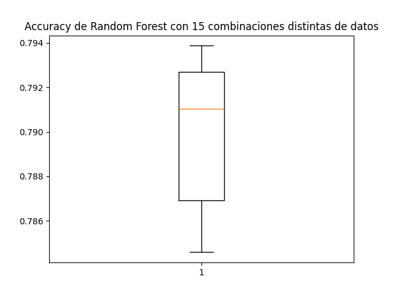
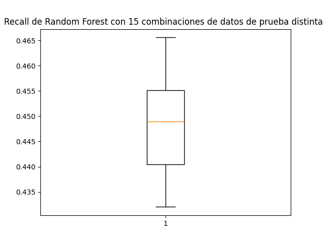

# Random Forest

## Implementación 1

A partir de la implementación con las siguientes columnas:

- Bullied_on_school_property_in_past_12_months
- Physically_attacked
- Other_students_kind_and_helpful
- Most_of_the_time_or_always_felt_lonely
- Missed_classes_or_school_without_permission
- Y prediciendo la columna 'Bullied_on_school_property_in_past_12_months', generando 250 arboles, se obtuvieron los siguientes resultados en relacion al accuracy del modelo :

### **_Con conjunto de entrenamiento_**

### Matriz de confusión

|              | Predicted 0 | Predicted 1 |
| ------------ | ----------- | ----------- |
| **Actual 0** | 31764       | 537         |
| **Actual 1** | 7852        | 735         |

### Reporte de la clasificación

|                  | Precision | Recall | F1-Score | Support |
| ---------------- | --------- | ------ | -------- | ------- |
| **Class 0**      | 0.80      | 0.98   | 0.88     | 32301   |
| **Class 1**      | 0.58      | 0.09   | 0.15     | 8587    |
| **Accuracy**     |           |        | 0.79     | 40888   |
| **Macro Avg**    | 0.69      | 0.53   | 0.52     | 40888   |
| **Weighted Avg** | 0.75      | 0.79   | 0.73     | 40888   |

### **_Con conjunto de prueba_**

### Matriz de confusión

|              | Predicted 0 | Predicted 1 |
| ------------ | ----------- | ----------- |
| **Actual 0** | 7876        | 155         |
| **Actual 1** | 2041        | 150         |

### Reporte de la clasificación

|                  | Precision | Recall | F1-Score | Support |
| ---------------- | --------- | ------ | -------- | ------- |
| **Class 0**      | 0.79      | 0.98   | 0.88     | 8031    |
| **Class 1**      | 0.49      | 0.07   | 0.12     | 2191    |
| **Accuracy**     |           |        | 0.79     | 10222   |
| **Macro Avg**    | 0.64      | 0.52   | 0.50     | 10222   |
| **Weighted Avg** | 0.73      | 0.79   | 0.72     | 10222   |

### Gráficos

Tras ejecutarlo con distintos subconjuntos del dataset se obtuvieron los siguientes resultados:

---

## Implementación 2

A partir de la nueva implementación con las siguientes columnas y evaluando el conjunto de prueba:

- Bullied_in_past_12_months
- Physically_attacked
- Physical_fighting
- Felt_lonely
- Y prediciendo la columna 'Bullied_in_past_12_months', generando 250 arboles, se obtuvieron los siguientes resultados en relacion al recall del modelo :

### **_Con conjunto de entrenamiento_**

### Matriz de confusión

|              | Predicted 0 | Predicted 1 |
| ------------ | ----------- | ----------- |
| **Actual 0** | 19865       | 4746        |
| **Actual 1** | 8752        | 7525        |

### Reporte de la clasificación

|                  | Precision | Recall | F1-Score | Support |
| ---------------- | --------- | ------ | -------- | ------- |
| **Class 0**      | 0.69      | 0.81   | 0.75     | 24611   |
| **Class 1**      | 0.61      | 0.46   | 0.53     | 16277   |
| **Accuracy**     |           |        | 0.67     | 40888   |
| **Macro Avg**    | 0.65      | 0.63   | 0.64     | 40888   |
| **Weighted Avg** | 0.66      | 0.67   | 0.66     | 40888   |

### **_Con conjunto de prueba_**

### Matriz de confusión

|              | Predicted 0 | Predicted 1 |
| ------------ | ----------- | ----------- |
| **Actual 0** | 5012        | 1137        |
| **Actual 1** | 2226        | 1847        |

### Reporte de la clasificación

|                  | Precision | Recall | F1-Score | Support |
| ---------------- | --------- | ------ | -------- | ------- |
| **Class 0**      | 0.69      | 0.82   | 0.75     | 6149    |
| **Class 1**      | 0.62      | 0.45   | 0.52     | 4073    |
| **Accuracy**     |           |        | 0.6710   | 10222   |
| **Macro Avg**    | 0.66      | 0.63   | 0.64     | 10222   |
| **Weighted Avg** | 0.66      | 0.67   | 0.66     | 10222   |

### Gráficos

Tras ejecutarlo con distintos subconjuntos del dataset se obtuvieron los siguientes resultados:

