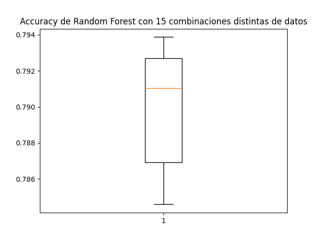
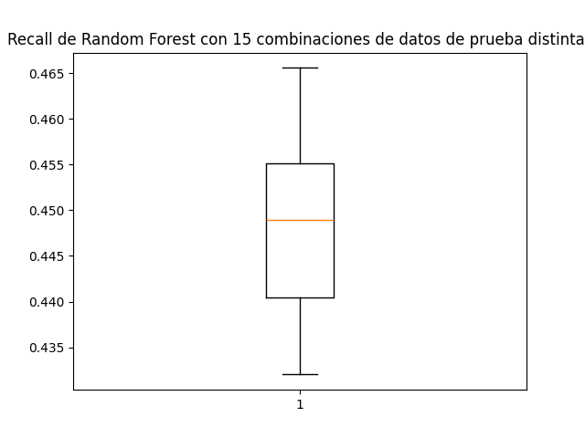

# Random Forest

Estos son los resultados obtenidos con el modelo de random forest:

## Matriz de confusión

|              | Predicted 0 | Predicted 1 |
| ------------ | ----------- | ----------- |
| **Actual 0** | 5156        | 1660        |
| **Actual 1** | 2414        | 2113        |

## Reporte de la clasificación

|                  | Precision | Recall | F1-Score | Support |
| ---------------- | --------- | ------ | -------- | ------- |
| **Class 0**      | 0.68      | 0.76   | 0.72     | 6816    |
| **Class 1**      | 0.56      | 0.47   | 0.51     | 4527    |
| **Accuracy**     |           |        | 0.6408   | 11343   |
| **Macro Avg**    | 0.62      | 0.61   | 0.61     | 11343   |
| **Weighted Avg** | 0.63      | 0.64   | 0.63     | 11343   |

A partir de la nueva implementación con las siguientes columnas:

['Bullied_on_school_property_in_past_12_months', 'Physically_attacked', 'Other_students_kind_and_helpful', 'Most_of_the_time_or_always_felt_lonely', 'Missed_classes_or_school_without_permission'] y prediciendo la columna 'Bullied_on_school_property_in_past_12_months' se obtuvieron los siguientes resultados en relacion al accuracy del modelo :

## Matriz de confusión

|              | Predicted 0 | Predicted 1 |
| ------------ | ----------- | ----------- |
| **Actual 0** | 5119        | 95          |
| **Actual 1** | 1283        | 91          |

## Reporte de la clasificación

|                  | Precision | Recall | F1-Score | Support |
| ---------------- | --------- | ------ | -------- | ------- |
| **Class 0**      | 0.80      | 0.98   | 0.88     | 5214    |
| **Class 1**      | 0.49      | 0.07   | 0.12     | 1374    |
| **Accuracy**     |           |        | 0.7908   | 6588    |
| **Macro Avg**    | 0.64      | 0.52   | 0.50     | 6588    |
| **Weighted Avg** | 0.73      | 0.79   | 0.72     | 6588    |

Tras ejecutarlo con distintos subconjuntos del dataset se obtuvieron los siguientes resultados:

A partir de la nueva implementación con las siguientes columnas y evaluando el conjunto de prueba:

['Bullied_in_past_12_months', 'Physically_attacked', 'Physical_fighting', 'Felt_lonely'] y prediciendo la columna 'Bullied_in_past_12_months' se obtuvieron los siguientes resultados en relacion al recall del modelo :

## Matriz de confusión

|              | Predicted 0 | Predicted 1 |
| ------------ | ----------- | ----------- |
| **Actual 0** | 5012        | 1137        |
| **Actual 1** | 2226        | 1847        |

## Reporte de la clasificación

|                  | Precision | Recall | F1-Score | Support |
| ---------------- | --------- | ------ | -------- | ------- |
| **Class 0**      | 0.69      | 0.82   | 0.75     | 6149    |
| **Class 1**      | 0.62      | 0.45   | 0.52     | 4073    |
| **Accuracy**     |           |        | 0.6710   | 10222   |
| **Macro Avg**    | 0.66      | 0.63   | 0.64     | 10222   |
| **Weighted Avg** | 0.66      | 0.67   | 0.66     | 10222   |

Tras ejecutarlo con distintos subconjuntos del dataset se obtuvieron los siguientes resultados:

Ahora lo mismo pero con el conjunto de entrenamiento:

## Matriz de confusión

|              | Predicted 0 | Predicted 1 |
| ------------ | ----------- | ----------- |
| **Actual 0** | 19865       | 4746        |
| **Actual 1** | 8752        | 7525        |

## Reporte de la clasificación

|                  | Precision | Recall | F1-Score | Support |
| ---------------- | --------- | ------ | -------- | ------- |
| **Class 0**      | 0.69      | 0.81   | 0.75     | 24611   |
| **Class 1**      | 0.61      | 0.46   | 0.53     | 16277   |
| **Accuracy**     |           |        | 0.67     | 40888   |
| **Macro Avg**    | 0.65      | 0.63   | 0.64     | 40888   |
| **Weighted Avg** | 0.66      | 0.67   | 0.66     | 40888   |
